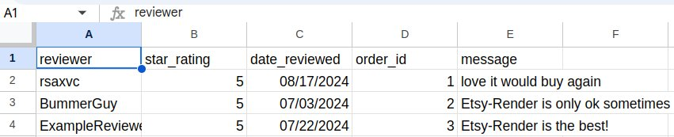
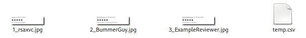
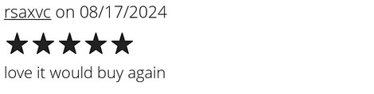
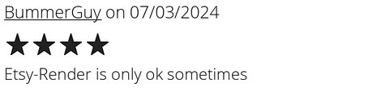
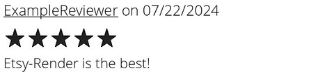

# EtsyReviewRender
Render reviews.json as JPEG images

# Example Output
Reviews are converted to a CSV file you can import into Microsoft Excel or Google Sheets:

Review-images are rendered to (OrderNumber)_(Reviewer).jpg:

Review-images looks like this:

# Tunables

* Specify the width of the output with `--width WIDTH`
* Specify the header-font style and size with `--headerFontSize HEADERFONTSIZE --headerFontTtf HEADERFONT.TTF`
* Specify the body-font style and size with `--bodyFontSize BODYFONTSIZE --bodyFontTtf BODYFONT.TTF`
* Exclude short messages with `--minMsgLen MINMSGLEN`
* Use a custom star-file with `--starFile STARFILE`

